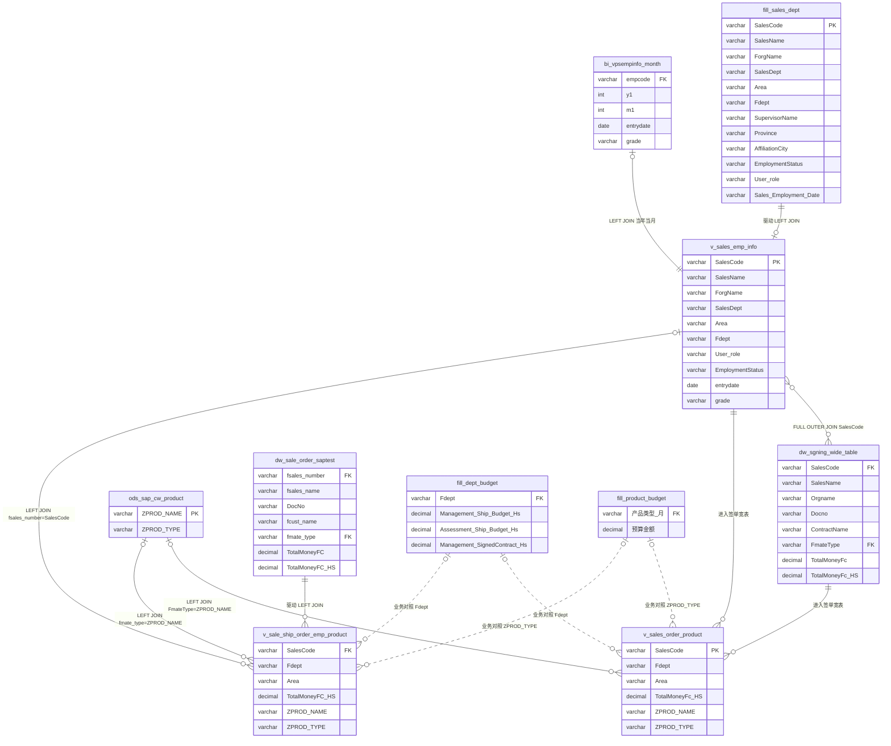
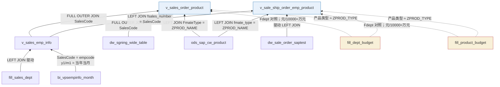

# csj_dw 表关联 ER

库：SQL Server `csj_dw`。  
依据：本文件夹 [`数据表与视图.md`](./数据表与视图.md) 中的三视图 DDL 与血缘说明。

文档**没有声明数据库外键**。下图是视图 JOIN 与达成口径里的预算对照，不是 SSMS 里的 FK 约束。

智能体生成 SQL **仅允许**四类对外对象：`v_sales_order_product`、`v_sale_ship_order_emp_product`、`fill_dept_budget`、`fill_product_budget`。组织视图和底层表禁止直查。

宽表金额单位是**元**，预算是**万元**，比较前：`SUM(宽表金额) / 10000`。

---

## 1. ER 图



图例：实线 = 视图 DDL 中的 JOIN；虚线 = 达成口径里的预算对照（不在视图 DDL 中）。

---

## 2. 血缘（底 → 顶）

```text
fill_sales_dept ──LEFT JOIN── bi_vpsempinfo_month（当年当月 y1/m1）
        │
        ▼
 v_sales_emp_info
        │
        ├── FULL OUTER JOIN dw_sgning_wide_table
        │         └── LEFT JOIN ods_sap_cw_product（FmateType = ZPROD_NAME）
        │                    ▼
        │         v_sales_order_product
        │
        └── 被 LEFT JOIN ← dw_sale_order_saptest（驱动表）
                  └── LEFT JOIN ods_sap_cw_product（fmate_type = ZPROD_NAME）
                             ▼
                  v_sale_ship_order_emp_product
```



要点：

- **签单宽表**：`v_sales_emp_info` **FULL OUTER JOIN** `dw_sgning_wide_table`，再 LEFT JOIN 产品分类。无订单的业务员、对不上组织的单据都会留下。
- **出货宽表**：**不是** FULL OUTER JOIN。以 `dw_sale_order_saptest` 为驱动，LEFT JOIN 组织视图，再 LEFT JOIN 产品分类。对不上业务员的出货行仍保留。
- 两宽表都间接依赖 `v_sales_emp_info`（其内再打 EHR 月表），引用成本高。

---

## 3. 对象总览

| 对象 | 类型 | 中文 | 智能体可查 | 业务上传 | 金额单位 |
|------|------|------|------------|----------|----------|
| `v_sales_order_product` | 视图 | 签单宽表 | 是 | 否 | 元 |
| `v_sale_ship_order_emp_product` | 视图 | 出货宽表 | 是 | 否 | 元 |
| `fill_dept_budget` | 表 | 科室月度预算 | 是 | 是 | 万元 |
| `fill_product_budget` | 表 | 产品类型月度预算 | 是 | 是 | 万元 |
| `v_sales_emp_info` | 视图 | 业务组织架构 | 否 | 否 | — |
| `fill_sales_dept` | 表 | 业务员部门架构 | 否 | 是 | — |
| `bi_vpsempinfo_month` | 表 | EHR 组织月表 | 否 | 否 | — |
| `dw_sgning_wide_table` | 表 | 销售签单明细 | 否 | 否 | 元 |
| `dw_sale_order_saptest` | 表 | 发货数据表 | 否 | 否 | 元 |
| `ods_sap_cw_product` | 表 | 机型所属分类 | 否 | 否 | — |

---

## 4. 关联清单

基数按 DDL 推断：LEFT 表示驱动侧必有、对端可空；FULL OUTER 两侧都可空。库中未建 FK。

| 从 | 到 | 连接 | ON / 对照 | 基数 | 落在 |
|----|----|------|-----------|------|------|
| `fill_sales_dept` | `v_sales_emp_info` | LEFT JOIN | 驱动表；输出全部业务员架构字段 | 1 → 1 | `v_sales_emp_info` |
| `bi_vpsempinfo_month` | `v_sales_emp_info` | LEFT JOIN | `SalesCode = empcode` 且 `y1/m1 = 当年当月` | 1 → 0..1 | `v_sales_emp_info` |
| `v_sales_emp_info` | `v_sales_order_product` | FULL OUTER JOIN | `emp.SalesCode = ord.SalesCode` | 0..1 ↔ 0..N | `v_sales_order_product` |
| `dw_sgning_wide_table` | `v_sales_order_product` | FULL OUTER JOIN | `emp.SalesCode = ord.SalesCode` | 0..N ↔ 0..1 | `v_sales_order_product` |
| `ods_sap_cw_product` | `v_sales_order_product` | LEFT JOIN | `ord.FmateType = pro.ZPROD_NAME` | 0..1 ← N | `v_sales_order_product` |
| `dw_sale_order_saptest` | `v_sale_ship_order_emp_product` | LEFT JOIN | 发货表为驱动，保留全部出货行 | 1 → 1 | `v_sale_ship_order_emp_product` |
| `v_sales_emp_info` | `v_sale_ship_order_emp_product` | LEFT JOIN | `s.fsales_number = emp.SalesCode` | 0..1 ← N | `v_sale_ship_order_emp_product` |
| `ods_sap_cw_product` | `v_sale_ship_order_emp_product` | LEFT JOIN | `s.fmate_type = p.ZPROD_NAME` | 0..1 ← N | `v_sale_ship_order_emp_product` |
| `fill_dept_budget` | `v_sales_order_product` | 业务对照 | `Fdept`；宽表金额 / 10000 → 万元 | 1 : N | 生成 SQL 达成口径 |
| `fill_dept_budget` | `v_sale_ship_order_emp_product` | 业务对照 | `Fdept`；管理/考核出机对照 `TotalMoneyFC_HS` | 1 : N | 生成 SQL 达成口径 |
| `fill_product_budget` | `v_sales_order_product` | 业务对照 | 产品类型 ≈ `ZPROD_TYPE` | 1 : N | 生成 SQL 达成口径 |
| `fill_product_budget` | `v_sale_ship_order_emp_product` | 业务对照 | 产品类型 ≈ `ZPROD_TYPE` | 1 : N | 生成 SQL 达成口径 |

---

## 5. 实体与字段

只收录本文件夹 DDL 与指标映射里写到的列。`fill_product_budget` 以及 EHR 月表的完整结构不在本目录。

### 5.1 `fill_sales_dept`（表 · 禁止直查 · 业务上传）

装备一事业部业务员部门架构。组织视图的驱动表。

| 字段 | 角色 | 说明 |
|------|------|------|
| `SalesCode` | 主键/业务键 | 驱动键 |
| `SalesName` | 属性 | 业务员姓名 |
| `ForgName` | 属性 | 组织名称 |
| `SalesDept` | 属性 | 销售部门 |
| `Area` | 属性 | 区域 |
| `Fdept` | 关联键 | 科室；预算对照键 |
| `SupervisorName` | 属性 | 主管 |
| `Province` | 属性 | 省 |
| `AffiliationCity` | 属性 | 归属城市 |
| `EmploymentStatus` | 属性 | 在职状态 |
| `User_role` | 属性 | 业务 / 领导等 |
| `Sales_Employment_Date` | 属性 | 入职日期 |

### 5.2 `bi_vpsempinfo_month`（表 · 禁止直查）

BI 取自 EHR。组织视图只取当年当月切片，不是全量历史。

| 字段 | 角色 | 说明 |
|------|------|------|
| `empcode` | 关联键 | `= fill_sales_dept.SalesCode` |
| `y1` / `m1` | 关联键 | `YEAR/MONTH(GETDATE())` |
| `entrydate` | 属性 | 入职日 |
| `grade` | 属性 | 职级 |

### 5.3 `v_sales_emp_info`（视图 · 禁止直查）

`fill_sales_dept` LEFT JOIN 当年当月 EHR。两宽表的组织字段都来自这里。

| 字段 | 角色 | 说明 |
|------|------|------|
| `SalesCode` | 主键/业务键 | 业务员工号 |
| `SalesName` | 属性 | 业务员姓名 |
| `ForgName` | 属性 | 组织名称 |
| `SalesDept` | 属性 | 销售部门 |
| `Area` | 属性 | 区域 |
| `Fdept` | 关联键 | 科室，预算对照键 |
| `SupervisorName` | 属性 | 主管 |
| `Province` | 属性 | 省 |
| `AffiliationCity` | 属性 | 归属城市 |
| `entrydate` | 属性 | 来自 EHR 月表 |
| `grade` | 属性 | 来自 EHR 月表 |
| `EmploymentStatus` | 属性 | 在职状态 |
| `User_role` | 属性 | 连续不签单等场景过滤「业务」 |
| `Sales_Employment_Date` | 属性 | 入职日期 |

### 5.4 `dw_sgning_wide_table`（表 · 禁止直查）

签单事实表。与组织视图 FULL OUTER JOIN，故无单人员工业会出现在签单宽表中。

| 字段 | 角色 | 说明 |
|------|------|------|
| `SalesCode` | 关联键 | FOJ 组织视图 |
| `SalesName` | 属性 | 业务员姓名 |
| `Orgname` | 属性 | 组织 |
| `SalesOrgName` | 属性 | 销售组织 |
| `SalesDocnoDate` | 属性 | 单据日期 |
| `Fyear` / `Fmonth` | 属性 | 年月 |
| `Auart` / `AuartName` | 属性 | 订单类型 |
| `Werks` | 属性 | 工厂 |
| `ContractName` / `Docno` / `DocnoNum` | 属性 | 合同与单据 |
| `KunnrCode` | 属性 | 客户编码 |
| `FmateNumber` / `FmateSeris` / `FmateType` | 关联键 | `FmateType = ZPROD_NAME` |
| `Fqty` | 属性 | 数量 |
| `TotalMoneyFc` / `TotalMoneyFc_HS` | 金额指标 | 不含税 / 含税签单，元 |

### 5.5 `dw_sale_order_saptest`（表 · 禁止直查）

出货宽表的驱动表。无匹配业务员时组织字段为空，行仍保留。

| 字段 | 角色 | 说明 |
|------|------|------|
| `fsales_number` | 关联键 | `= 组织视图 SalesCode` |
| `fsales_name` | 属性 | 业务员姓名 |
| `Orgname` | 属性 | 组织 |
| `DocNo` | 属性 | 出货单号 |
| `BusinessDate` / `fyear` / `fperiod` | 属性 | 业务日期与期间 |
| `fcust_number` / `fcust_name` | 属性 | 客户 |
| `fmate_number` / `fmate_name` / `fmate_type` | 关联键 | `fmate_type = ZPROD_NAME` |
| `FQTY` | 属性 | 数量 |
| `TotalMoneyFC` / `TotalMoneyFC_HS` | 金额指标 | 不含税 / 含税出货，元 |

### 5.6 `ods_sap_cw_product`（表 · 禁止直查）

两宽表都经物料类型字段 LEFT JOIN 本表得到 `ZPROD_NAME` / `ZPROD_TYPE`。

| 字段 | 角色 | 说明 |
|------|------|------|
| `ZPROD_NAME` | 主键/业务键 | 与机型/物料类型对齐 |
| `ZPROD_TYPE` | 属性 | 产品类型，供预算对照 |

### 5.7 `v_sales_order_product`（视图 · 智能体可查）

组织视图 FULL OUTER JOIN 签单明细，再 LEFT JOIN 产品分类；视图内有 GROUP BY。金额单位元。

| 字段 | 角色 | 说明 |
|------|------|------|
| `SalesCode` | 主键/业务键 | `COALESCE(emp, ord)` |
| `empSalesCode` / `ordSalesCode` | 关联键 | 两侧原始工号 |
| `Fdept` / `Area` | 属性 | 来自组织视图 |
| `User_role` | 属性 | 人员角色 |
| `Docno` / `ContractName` | 属性 | 单据与合同 |
| `TotalMoneyFc` / `TotalMoneyFc_HS` | 金额指标 | 不含税 / 含税签单，元 |
| `ZPROD_NAME` / `ZPROD_TYPE` | 关联键 | 产品分类 |

### 5.8 `v_sale_ship_order_emp_product`（视图 · 智能体可查）

以发货表为驱动 LEFT JOIN 组织视图与产品分类。金额单位元。

| 字段 | 角色 | 说明 |
|------|------|------|
| `SalesCode` | 关联键 | `s.fsales_number` |
| `empSalesCode` | 关联键 | 组织视图工号 |
| `Fdept` / `Area` | 属性 | LEFT JOIN 组织视图 |
| `User_role` | 属性 | 人员角色 |
| `DocNo` / `fcust_name` | 属性 | 出货单与客户 |
| `TotalMoneyFC` / `TotalMoneyFC_HS` | 金额指标 | 不含税 / 含税出货，元 |
| `ZPROD_NAME` / `ZPROD_TYPE` | 关联键 | 产品分类 |

### 5.9 `fill_dept_budget`（表 · 智能体可查 · 业务上传）

未出现在三视图 DDL 中，由生成 SQL 按科室对照宽表。月度键字段本文件夹未给出完整字典。

| 字段 | 角色 | 说明 |
|------|------|------|
| `Fdept` | 关联键 | 科室；文档按此与宽表对照 |
| `Management_Ship_Budget_Hs` | 金额指标 | 管理出机预算（万元，含税） |
| `Assessment_Ship_Budget_Hs` | 金额指标 | 考核出机预算（万元，含税） |
| `Management_SignedContract_Hs` | 金额指标 | 管理签单预算（万元，含税） |

### 5.10 `fill_product_budget`（表 · 智能体可查 · 业务上传）

未出现在三视图 DDL 中，由生成 SQL 按产品类型对照宽表。完整字段名以 `SQL语句生成V2.md` 为准，本目录未收录。

| 字段 | 角色 | 说明 |
|------|------|------|
| 产品类型 × 月 | 关联键 | 文档仅写粒度 |
| 预算金额 | 金额指标 | 万元；对照宽表 `ZPROD_TYPE` |

---

## 6. 预算对照

| 业务说法 | 实际（宽表，元） | 预算（科室，万元，含税） |
|----------|------------------|--------------------------|
| 管理出机 | 出货 `TotalMoneyFC_HS` | `fill_dept_budget.Management_Ship_Budget_Hs` |
| 考核出机 | 出货 `TotalMoneyFC_HS` | `fill_dept_budget.Assessment_Ship_Budget_Hs` |
| 管理签单 | 签单 `TotalMoneyFc_HS` | `fill_dept_budget.Management_SignedContract_Hs` |

达成类按 `Fdept` 全量、不过滤 `User_role`。连续不签单 / 未出机才用 `User_role=业务`，并按 `SalesCode` 聚合。

---

## 7. 扫描范围

本文件夹可读明文：`README.md`、`数据表与视图.md`、`关键文件与检查清单.md`、`数据库连接.md`。

`er_relationships.csv` 与 `er_table_dictionary.csv` 是二进制内容，无法当作字典解析。上级 `SQL语句生成V2.md` 不在本目录，预算表完整字段仍以那份为准。
